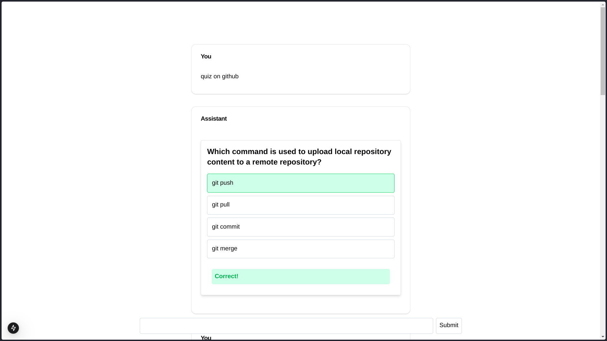

# Atoms

## Screenshot

## Setps to add a UI Component to Chatbot

1. Create a new component in the `src/components/mdx-components` directory.
2. Import the component in the `src/components/memoized-mdx.tsx` file.
3. Add the component to the `components` object in the `src/components/memoized-mdx.tsx` file.
4. Update the Prompt in the `app/api/chat/route.ts` file to let the chatbot know about the new component.